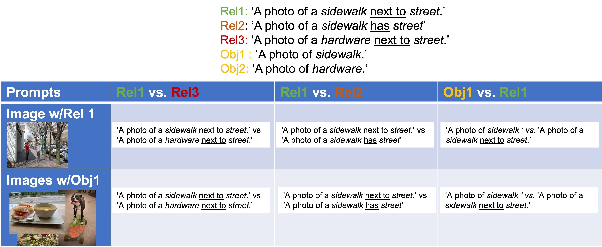
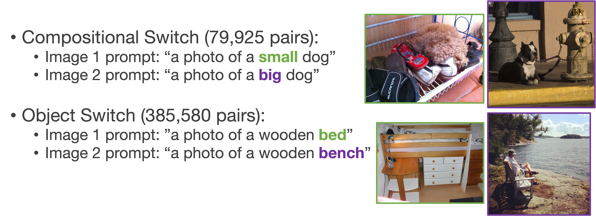
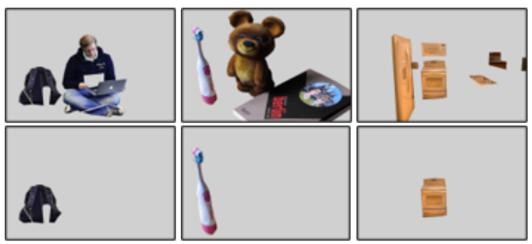
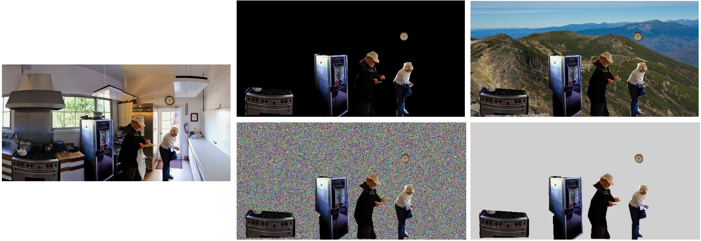

# Model Understanding Benchmark
These datasets are designed to be an easy-to-moderate task for visual-language contrastive models and measure how well
these models understand. The idea is we want to know if models are using hacks or memorization as opposed to learned
understanding of object-object relations, contextual relations to objects, object co-occurrences, and attribute-object 
relations. 

There are three types of datasets: context, composition, and relations.

These datasets rely on [Visual Genome](http://visualgenome.org/api/v0/api_home.html) and [COCO validation 2014](https://cocodataset.org/#home).
In order to use these annotations, downloading the orignal images is required. For COCO, `Val2014` is the only required while 
for Visual Genome the entire dataset. 

## Relational Dataset
This dataset is built off of [Visual Genome](http://visualgenome.org/api/v0/api_home.html). This dataset was created by cleaning the annotations with relations 
that are specifically an interaction rather than an attribute which was often an erroneous annotation and grouping
relations that are the same despite spelling errors. Objects and predicates are additionally cleaned based on spelling 
errors. Using the extracted (subject, predicate, object) triplets, unlikely relationships are determined if there is no
existing combination of an object-predicate pair or subject-object pair. For each image, the ground truth relation is 
compared to a highly unlikely swap of subject and predicate. There are set of "positive" images that are images with 
the subject being swapped and no other objects from the original image. There are also a set of "negative" images that 
are images with the swapped subject and no other objects from the original image. The predicate swapped is based on the 
predicates that have not been found in the original dataset to be associated with the original subject and therefore are highly unlikely.

The dataset stored in `relation_eval_subject.json` structure is as follows: 
```json
{
  "2317469": {"positive_image_ids": [2347085,
  2347556,
  2361364,
  655,
  2411388,
  2349311,
  2385870,
  2327638,
  2405565,
  1159441],
 "negative_image_ids": [2413296,
  2368727,
  2375277,
  2319315,
  2406936,
  2344369,
  2328323,
  2417504,
  2322012,
  286008],
 "positive_prompt": "A photo of a snow covering ground.",
 "negative_prompt": "A photo of a cracker covering ground.",
 "negative_object": "cracker",
 "positive_object": "snow",
 "negative_predicate_prompt": "A photo of a snow flying in front of ground."},
  "2370468": {"ositive_image_ids": [2413642,
  2388513,
  2392460,
  2415901,
  3147,
  2324924,
  2313,
  2364800,
  713878,
  713724],
 "negative_image_ids": [2378866,
  2376935,
  2393302,
  2325157,
  2370074,
  2367017,
  2346875,
  2415900,
  2380858,
  2386346],
 "positive_prompt": "A photo of a building outside window.",
 "negative_prompt": "A photo of a guard outside window.",
 "negative_object": "guard",
 "positive_object": "building",
 "negative_predicate_prompt": "A photo of a building draped in front of window."}
}
```
Note: Because there is no agreed upon split, these are selected from the entire dataset.
Dataset Facts:
* 99,960 annotations
* 6,006 objects
* 2,546 relationship aliases


### Evaluation

To evaluate on this dataset, multiple comparisons are made:
* Anchor image compared to the ground truth prompt and a prompt with the subject swapped
* Anchor image compared to the ground truth prompt and a prompt with the predicate swapped
* Anchor image compared to the ground truth prompt and a subject-only prompt (no relation)
* Mean features of the subject-only "positive" images compared to subject-only prompt (no relation) and the anchor image"s relation prompt
* Mean features of the subject-only "positive" images compared to the anchor image"s relation prompt and the anchor image"s relation prompt with a swapped subject
* Mean features of the subject-only "positive" images compared the anchor image"s relation prompt and the anchor image"s relation prompt with a swapped predicate

These comparisons are designed to tell us: 
* `Rel1 vs. Rel3`: If the model is able to recognize an object is NOT present. 
* `Rel1 vs. Rel2`: If the model has learned possible subject-object relationships and can reject non-realistic ones instead of just using object-object co-occurance.
* `Obj1 vs. Rel1`: If the model ignores relationships all-together and focuses only on object recognition

## Compositional Dataset
This dataset is built of the [COCO validation 2014](https://cocodataset.org/#home) dataset. Using the NLP library  
[NLTK](https://www.nltk.org/) and the COCO caption annotations, words are tagged and pairs of adjective and nouns are 
extracted. These pairs are then manually cleaned to ensure the attribute is indeed an adjective and the object is indeed 
an object. Instead of using unlikely combinations, antonyms were manually mapped to each attribute in order to ensure 
that the attribute is not present in the image. For example, if there is a "a small dog", the comparison prompt is 
"a large dog"

There are two splits for this dataset. The first is where the composition is swapped with an antonym and the other is 
where an object is switched. Each dataset has two images and two captions and comparisons are based on how well the 
model can match the captions to the correct images. 



### Split1 Compositional Switch:
* 79,925 Comparisons
* 114 Compositions
* 790 objects

```json
[{"img1_prompt": "A photo of a small dog.",
 "img1_id": "42",
 "img1_composition": "small",
 "img1_object": "dog",
 "img2_id": 371046,
 "img2_prompt": "A photo of a large dog.",
 "img2_composition": "large",
 "img2_object": "dog"},
{"img1_prompt": "A photo of a white dog.",
 "img1_id": "74",
 "img1_composition": "white",
 "img1_object": "dog",
 "img2_id": 240637,
 "img2_prompt": "A photo of a black dog.",
 "img2_composition": "black",
 "img2_object": "dog"}]
```

### Split2 Object Switch:
* 385,580 Comparisons
* 116 Compositions
* 2,475 objects

```json
[{"img1_prompt": "A photo of a small dog.",
 "img1_id": "42",
 "img1_composition": "small",
 "img1_object": "dog",
 "img2_id": 514990,
 "img2_prompt": "A photo of a small boy.",
 "img2_composition": "small",
 "img2_object": "boy"},
  {"img1_prompt": "A photo of a white dog.",
 "img1_id": "74",
 "img1_composition": "white",
 "img1_object": "dog",
 "img2_id": 437393,
 "img2_prompt": "A photo of a white horse.",
 "img2_composition": "white",
 "img2_object": "horse"}]
```
### Evaluation
To evaluate on this dataset, multiple comparisons are made:
* Each image is compared to each prompt.
* The metrics used are from the [Winoground paper](https://arxiv.org/pdf/2204.03162.pdf):
  * Text Accuracy: `Image1 + Prompt1 > Image1 + Prompt2 AND Image2 + Prompt2 > Image2 + Prompt2`
  * Image Accuracy: `Image1 + Prompt1 > Image2 + Propmt1 AND Image2 + Prompt2 > Image1 + Prompt2`
  * Group Accuracy: `Image Accuracy AND Text Accuracy`
* Also look at the mean softmax value for the corract pairs to measure model confidence
  * `(Softmax(Image1+Prompt1, Image1+Prompt2)[0] + Softmax(Image2+Prompt2, Image2+Prompt1)[0]) /2`

## Context Dataset
This dataset is built off [COCO validation 2014](https://cocodataset.org/#home) and looks at the co-occurrence between 
objects and reliance on background cues. This dataset has modified images and can be downloaded [here]().

The first set is used to evaluate co-occurence. For each image, it removes all other objects using either the segmentation
(retaining shape cues) or bounding box annotations (no shape cues). These are replaced with either "black", "gray", or
"noise". Images are chosen if they do not have overlapping bounding boxes and if their object area is over a threshold 
to allow for better visibility, making the task easier.

### Split1 Object Co-Occurrence:
* 9,375 Images * 2 removal masks * 3 replacement fillings
* 2,259 Original COCO images modified
* 79 objects 
* 


Example annotations:
```json
[{"image_id": 136,
 "object": "person",
 "other_objects": ["giraffe"],
 "path": "person_COCO_val2014_000000000136.jpg"},
{"image_id": 136,
 "object": "giraffe",
 "other_objects": ["person"],
 "path": "giraffe_COCO_val2014_000000000136.jpg"}
]
```

### Split 2 Background Context:
The second set removes backgrounds and replaces them with fillings of either "gray", "black", "noise" or some 
landscape scenery from a subset of the [Kaggle Landscape dataset](https://www.kaggle.com/datasets/arnaud58/landscape-pictures/)
and [Indoor Scenes dataset](https://web.mit.edu/torralba/www/indoor.html) from this [paper](http://people.csail.mit.edu/torralba/publications/indoor.pdf).
The subset of 290 images were selected based on whether there were any objects in the image that are also in the annotations.

. 

* 31,765 Images * 3 replacement fillings
* 80 objects 

Example annotation:
```json
[{"annotations": {"bed": [{"segmentation": [[92.56,
      24.39,
      46.28,
      94.71,
      9.33]],
    "area": 179829.76725000003,
    "iscrowd": 0,
    "image_id": 133,
    "bbox": [13.99, 2.87, 626.01, 418.65],
    "category_id": 65,
    "id": 317921}],
  "teddy bear": [{"segmentation": [[536.56,
      45.99,
      538.04,
      46.21]],
    "area": 683.9160000000005,
    "iscrowd": 0,
    "image_id": 133,
    "bbox": [525.34, 20.93, 47.95, 28.72],
    "category_id": 88,
    "id": 1673328}]},
 "image": "COCO_val2014_000000000133.jpg",
 "image_id": 133},
{"annotations": {"dog": [{"segmentation": [[382.48,
      268.63,
      330.24,
      394.09,
      264.76]],
    "area": 53481.5118,
    "iscrowd": 0,
    "image_id": 42,
    "bbox": [214.15, 41.29, 348.26, 243.78],
    "category_id": 18,
    "id": 1817255}]},
 "image": "COCO_val2014_000000000042.jpg",
 "image_id": 42}]
```

